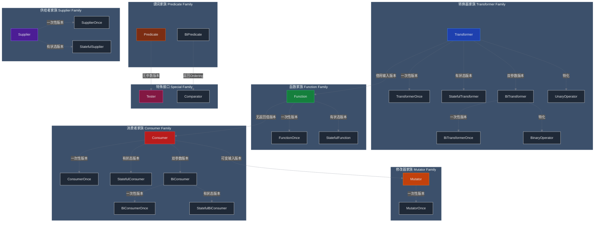

# Prism3 Rust Function 库接口汇总报告

## 📋 概述

`prism3-rust-function` 是一个功能强大的 Rust 函数式编程抽象库,提供了类似 Java 函数式接口的 Rust 实现。该库包含 **24 个核心模块**,涵盖了函数式编程的各个方面。

## 🎯 核心设计理念

### 1. 统一的设计模式

所有接口都遵循相同的设计模式:

- **核心 Trait**: 定义统一的接口行为
- **三种实现**: 针对不同所有权模型
  - `Box*`: 单一所有权,不可克隆
  - `Rc*`: 单线程共享所有权,可克隆
  - `Arc*`: 多线程共享所有权,可克隆且线程安全
- **扩展 Trait**: 为闭包提供扩展方法(如 `FnPredicateOps`)
- **类型转换**: 提供 `into_*` 和 `to_*` 系列方法

### 2. 所有权模型对比

| 类型前缀 | 所有权 | 可克隆 | 线程安全 | 组合API | 适用场景 |
|---------|--------|--------|---------|---------|---------|
| `Box*` | 单一 | ❌ | ❌ | 消耗 `self` | 一次性使用 |
| `Rc*` | 共享 | ✅ | ❌ | 借用 `&self` | 单线程复用 |
| `Arc*` | 共享 | ✅ | ✅ | 借用 `&self` | 多线程共享 |

## 📦 接口分类汇总

### 接口总览表

| 接口名称 | 功能描述 | 签名 | 输入类型 | 输出类型 | 自身状态 |
|---------|---------|------|---------|---------|---------|
| **Transformer** | 值转换器 | `Fn(T) -> R` | `T` | `R` | 无状态 |
| **TransformerOnce** | 一次性转换器 | `FnOnce(T) -> R` | `T` | `R` | 无状态 |
| **StatefulTransformer** | 有状态转换器 | `FnMut(T) -> R` | `T` | `R` | 有状态 |
| **Function** | 引用函数 | `Fn(&T) -> R` | `&T` | `R` | 无状态 |
| **FunctionOnce** | 一次性引用函数 | `FnOnce(&T) -> R` | `&T` | `R` | 无状态 |
| **StatefulFunction** | 有状态函数 | `FnMut(&T) -> R` | `&T` | `R` | 有状态 |
| **Consumer** | 只读消费者 | `Fn(&T)` | `&T` | 无 | 无状态 |
| **ConsumerOnce** | 一次性消费者 | `FnOnce(&T)` | `&T` | 无 | 无状态 |
| **StatefulConsumer** | 有状态消费者 | `FnMut(&T)` | `&T` | 无 | 有状态 |
| **Mutator** | 可变修改器 | `FnMut(&mut T)` | `&mut T` | 无 | 无状态 |
| **MutatorOnce** | 一次性修改器 | `FnOnce(&mut T)` | `&mut T` | 无 | 无状态 |
| **Predicate** | 单参数谓词 | `Fn(&T) -> bool` | `&T` | `bool` | 无状态 |
| **BiPredicate** | 双参数谓词 | `Fn(&T, &U) -> bool` | `&T, &U` | `bool` | 无状态 |
| **Supplier** | 只读供给者 | `Fn() -> T` | 无 | `T` | 无状态 |
| **SupplierOnce** | 一次性供给者 | `FnOnce() -> T` | 无 | `T` | 无状态 |
| **StatefulSupplier** | 有状态供给者 | `FnMut() -> T` | 无 | `T` | 有状态 |
| **BiTransformer** | 双参数转换器 | `Fn(T, U) -> R` | `T, U` | `R` | 无状态 |
| **BiTransformerOnce** | 一次性双参数转换器 | `FnOnce(T, U) -> R` | `T, U` | `R` | 无状态 |
| **BiConsumer** | 双参数只读消费者 | `Fn(&T, &U)` | `&T, &U` | 无 | 无状态 |
| **BiConsumerOnce** | 一次性双参数消费者 | `FnOnce(&T, &U)` | `&T, &U` | 无 | 无状态 |
| **StatefulBiConsumer** | 有状态双参数消费者 | `FnMut(&T, &U)` | `&T, &U` | 无 | 有状态 |
| **Tester** | 测试器 | `Fn() -> bool` | 无 | `bool` | 无状态 |
| **Comparator** | 比较器 | `Fn(&T, &T) -> Ordering` | `&T, &T` | `Ordering` | 无状态 |

### 一、转换器家族 (Transformer Family)

转换器家族包含所有将输入转换为输出的接口，按状态管理和调用次数分为三个子类：

#### 1. Transformer - 无状态转换器

**签名**: `Fn(T) -> R` (消耗输入,产生输出)

**核心 Trait**:
```rust
pub trait Transformer<T, R> {
    fn apply(&self, input: T) -> R;
}
```

**实现类型**:
- `BoxTransformer<T, R>`: 单一所有权
- `RcTransformer<T, R>`: 单线程共享
- `ArcTransformer<T, R>`: 多线程共享

**特殊类型**:
- `UnaryOperator<T>`: `Transformer<T, T>` 的别名,输入输出类型相同
- `BoxUnaryOperator<T>`, `RcUnaryOperator<T>`, `ArcUnaryOperator<T>`

**条件执行**:
- `ConditionalTransformer`: 支持 `when()` 条件判断
- `BoxConditionalTransformer`, `RcConditionalTransformer`, `ArcConditionalTransformer`

**核心方法**:
- `apply(input: T) -> R`: 执行转换
- `and_then()`: 链式组合
- `when()`: 条件执行
- `or_else()`: 条件分支

**使用场景**:
- 类型转换
- 数据映射
- 管道处理

---

#### 2. TransformerOnce - 一次性转换器

**签名**: `FnOnce(T) -> R` (只能调用一次)

**核心 Trait**:
```rust
pub trait TransformerOnce<T, R> {
    fn apply(self, input: T) -> R;
}
```

**实现类型**:
- `BoxTransformerOnce<T, R>`
- `UnaryOperatorOnce<T>`: 输入输出类型相同的特殊版本
- `BoxUnaryOperatorOnce<T>`

**条件执行**:
- `ConditionalTransformerOnce`
- `BoxConditionalTransformerOnce`

**使用场景**:
- 消耗资源的一次性转换
- 移动语义场景

---

#### 3. StatefulTransformer - 有状态转换器

**签名**: `FnMut(T) -> R` (可变自身,消耗输入)

**核心 Trait**:
```rust
pub trait StatefulTransformer<T, R> {
    fn apply(&mut self, input: T) -> R;
}
```

**实现类型**:
- `BoxStatefulTransformer<T, R>`
- `RcStatefulTransformer<T, R>`: 使用 `RefCell`
- `ArcStatefulTransformer<T, R>`: 使用 `Mutex`

**条件执行**:
- `ConditionalStatefulTransformer`
- `BoxConditionalStatefulTransformer`, `RcConditionalStatefulTransformer`, `ArcConditionalStatefulTransformer`

**核心方法**:
- `apply(input: T) -> R`: 执行转换
- `and_then()`: 链式组合
- `when()`: 条件执行

**使用场景**:
- 计数器
- 累加器
- 状态机

---

#### 4. BiTransformer - 双参数转换器

**签名**: `Fn(T, U) -> R` (消耗两个输入,产生输出)

**核心 Trait**:
```rust
pub trait BiTransformer<T, U, R> {
    fn apply(&self, first: T, second: U) -> R;
}
```

**实现类型**:
- `BoxBiTransformer<T, U, R>`
- `RcBiTransformer<T, U, R>`
- `ArcBiTransformer<T, U, R>`

**特殊类型**:
- `BinaryOperator<T>`: `BiTransformer<T, T, T>` 的别名
- `BoxBinaryOperator<T>`, `RcBinaryOperator<T>`, `ArcBinaryOperator<T>`

**核心方法**:
- `apply(first: T, second: U) -> R`: 执行转换
- `and_then()`: 链式组合
- `when()`: 条件执行

**使用场景**:
- 二元运算(加法、乘法等)
- 合并操作
- 比较运算

---

#### 5. BiTransformerOnce - 一次性双参数转换器

**签名**: `FnOnce(T, U) -> R`

**核心 Trait**:
```rust
pub trait BiTransformerOnce<T, U, R> {
    fn apply(self, first: T, second: U) -> R;
}
```

**实现类型**:
- `BoxBiTransformerOnce<T, U, R>`
- `BinaryOperatorOnce<T>`: 输入输出类型相同
- `BoxBinaryOperatorOnce<T>`

---

### 二、函数家族 (Function Family)

函数家族包含所有借用输入并产生输出的接口，按状态管理分为两个子类：

#### 6. Function - 无状态函数

**签名**: `Fn(&T) -> R` (借用输入,产生输出)

**核心 Trait**:
```rust
pub trait Function<T, R> {
    fn apply(&self, input: &T) -> R;
}
```

**实现类型**:
- `BoxFunction<T, R>`
- `RcFunction<T, R>`
- `ArcFunction<T, R>`

**条件执行**:
- `ConditionalFunction`
- `BoxConditionalFunction`, `RcConditionalFunction`, `ArcConditionalFunction`

**核心方法**:
- `apply(input: &T) -> R`: 执行函数
- `and_then()`: 链式组合
- `when()`: 条件执行
- `or_else()`: 条件分支

**与 Transformer 的区别**:
- `Function`: 借用输入 `&T`,不消耗
- `Transformer`: 消耗输入 `T`,获取所有权

**使用场景**:
- 只读计算
- 数据提取
- 属性访问

---

#### 7. FunctionOnce - 一次性函数

**签名**: `FnOnce(&T) -> R`

**核心 Trait**:
```rust
pub trait FunctionOnce<T, R> {
    fn apply(self, input: &T) -> R;
}
```

**实现类型**:
- `BoxFunctionOnce<T, R>`

---

#### 8. StatefulFunction - 有状态函数

**签名**: `FnMut(&T) -> R` (可变自身,借用输入)

**核心 Trait**:
```rust
pub trait StatefulFunction<T, R> {
    fn apply(&mut self, input: &T) -> R;
}
```

**实现类型**:
- `BoxStatefulFunction<T, R>`
- `RcStatefulFunction<T, R>`
- `ArcStatefulFunction<T, R>`

**条件执行**:
- `ConditionalStatefulFunction`
- `BoxConditionalStatefulFunction`, `RcConditionalStatefulFunction`, `ArcConditionalStatefulFunction`

---

### 三、消费者家族 (Consumer Family)

消费者家族包含所有消费输入但不产生输出的接口，按状态管理分为三个子类：

#### 9. Consumer - 无状态消费者

**签名**: `Fn(&T)` (借用输入,无返回值)

**核心 Trait**:
```rust
pub trait Consumer<T> {
    fn accept(&self, value: &T);
}
```

**实现类型**:
- `BoxConsumer<T>`
- `RcConsumer<T>`
- `ArcConsumer<T>`

**核心方法**:
- `accept(value: &T)`: 执行消费
- `and_then()`: 链式组合

**使用场景**:
- 日志记录
- 数据观察
- 通知发送

---

#### 10. ConsumerOnce - 一次性消费者

**签名**: `FnOnce(&T)`

**核心 Trait**:
```rust
pub trait ConsumerOnce<T> {
    fn accept(self, value: &T);
}
```

**实现类型**:
- `BoxConsumerOnce<T>`

---

#### 11. StatefulConsumer - 有状态消费者

**签名**: `FnMut(&T)` (可变自身,借用输入,无返回值)

**核心 Trait**:
```rust
pub trait StatefulConsumer<T> {
    fn accept(&mut self, value: &T);
}
```

**实现类型**:
- `BoxStatefulConsumer<T>`
- `RcStatefulConsumer<T>`
- `ArcStatefulConsumer<T>`

**核心方法**:
- `accept(value: &T)`: 执行消费
- `and_then()`: 链式组合

**使用场景**:
- 统计计数
- 累积求和
- 状态记录

---

#### 12. BiConsumer - 双参数消费者

**签名**: `Fn(&T, &U)` (借用两个输入,无返回值)

**核心 Trait**:
```rust
pub trait BiConsumer<T, U> {
    fn accept(&self, first: &T, second: &U);
}
```

**实现类型**:
- `BoxBiConsumer<T, U>`
- `RcBiConsumer<T, U>`
- `ArcBiConsumer<T, U>`

**核心方法**:
- `accept(first: &T, second: &U)`: 执行消费
- `and_then()`: 链式组合

**使用场景**:
- 键值对处理
- 双参数日志
- 关系记录

---

#### 13. BiConsumerOnce - 一次性双参数消费者

**签名**: `FnOnce(&T, &U)`

**核心 Trait**:
```rust
pub trait BiConsumerOnce<T, U> {
    fn accept(self, first: &T, second: &U);
}
```

**实现类型**:
- `BoxBiConsumerOnce<T, U>`

---

#### 14. StatefulBiConsumer - 有状态双参数消费者

**签名**: `FnMut(&T, &U)` (可变自身,借用两个输入)

**核心 Trait**:
```rust
pub trait StatefulBiConsumer<T, U> {
    fn accept(&mut self, first: &T, second: &U);
}
```

**实现类型**:
- `BoxStatefulBiConsumer<T, U>`
- `RcStatefulBiConsumer<T, U>`
- `ArcStatefulBiConsumer<T, U>`

---

### 四、修改器家族 (Mutator Family)

修改器家族包含所有修改输入但不产生输出的接口：

#### 15. Mutator - 可变修改器

**签名**: `FnMut(&mut T)` (可变借用输入,无返回值)

**核心 Trait**:
```rust
pub trait Mutator<T> {
    fn mutate(&mut self, value: &mut T);
}
```

**实现类型**:
- `BoxMutator<T>`
- `RcMutator<T>`: 使用 `RefCell` 实现内部可变性
- `ArcMutator<T>`: 使用 `Mutex` 实现线程安全

**条件执行**:
- `ConditionalMutator`
- `BoxConditionalMutator`, `RcConditionalMutator`, `ArcConditionalMutator`

**核心方法**:
- `mutate(value: &mut T)`: 执行修改
- `and_then()`: 链式组合
- `when()`: 条件执行
- `or_else()`: 条件分支

**与 Consumer 的区别**:
- `Consumer`: 只读 `&T`,不修改输入
- `Mutator`: 可变 `&mut T`,可以修改输入

**使用场景**:
- 就地修改
- 状态更新
- 配置调整

---

#### 16. MutatorOnce - 一次性修改器

**签名**: `FnOnce(&mut T)`

**核心 Trait**:
```rust
pub trait MutatorOnce<T> {
    fn mutate(self, value: &mut T);
}
```

**实现类型**:
- `BoxMutatorOnce<T>`

**条件执行**:
- `ConditionalMutatorOnce`
- `BoxConditionalMutatorOnce`

---

### 五、谓词家族 (Predicate Family)

谓词家族包含所有返回布尔值的接口：

#### 17. Predicate - 单参数谓词

**签名**: `Fn(&T) -> bool` (借用输入,返回布尔值)

**核心 Trait**:
```rust
pub trait Predicate<T> {
    fn test(&self, value: &T) -> bool;
}
```

**实现类型**:
- `BoxPredicate<T>`
- `RcPredicate<T>`
- `ArcPredicate<T>`

**核心方法**:
- `test(value: &T) -> bool`: 执行判断
- `and()`: 逻辑与组合
- `or()`: 逻辑或组合
- `not()`: 逻辑非
- `xor()`: 逻辑异或

**静态方法**:
- `always_true()`: 总是返回 true 的谓词
- `always_false()`: 总是返回 false 的谓词

**使用场景**:
- 条件过滤
- 数据验证
- 规则判断

---

#### 18. BiPredicate - 双参数谓词

**签名**: `Fn(&T, &U) -> bool` (借用两个输入,返回布尔值)

**核心 Trait**:
```rust
pub trait BiPredicate<T, U> {
    fn test(&self, first: &T, second: &U) -> bool;
}
```

**实现类型**:
- `BoxBiPredicate<T, U>`
- `RcBiPredicate<T, U>`
- `ArcBiPredicate<T, U>`

**核心方法**:
- `test(first: &T, second: &U) -> bool`: 执行判断
- `and()`: 逻辑与
- `or()`: 逻辑或
- `not()`: 逻辑非

**使用场景**:
- 双参数比较
- 关系判断
- 复杂条件

---

### 六、供给者家族 (Supplier Family)

供给者家族包含所有不接收输入但产生输出的接口，按状态管理分为三个子类：

#### 19. Supplier - 无状态供给者

**签名**: `Fn() -> T` (无输入,产生输出)

**核心 Trait**:
```rust
pub trait Supplier<T> {
    fn get(&self) -> T;
}
```

**实现类型**:
- `BoxSupplier<T>`
- `RcSupplier<T>`
- `ArcSupplier<T>`

**核心方法**:
- `get() -> T`: 获取值
- `and_then()`: 链式组合

**特点**:
- 使用 `&self`,不修改自身状态
- `Arc` 实现无锁,高并发性能优异

**使用场景**:
- 工厂方法
- 常量生成
- 默认值提供

---

#### 20. SupplierOnce - 一次性供给者

**签名**: `FnOnce() -> T`

**核心 Trait**:
```rust
pub trait SupplierOnce<T> {
    fn get(self) -> T;
}
```

**实现类型**:
- `BoxSupplierOnce<T>`

---

#### 21. StatefulSupplier - 有状态供给者

**签名**: `FnMut() -> T` (可变自身,无输入)

**核心 Trait**:
```rust
pub trait StatefulSupplier<T> {
    fn get(&mut self) -> T;
}
```

**实现类型**:
- `BoxStatefulSupplier<T>`
- `RcStatefulSupplier<T>`
- `ArcStatefulSupplier<T>`

**核心方法**:
- `get() -> T`: 获取值
- `and_then()`: 链式组合

**使用场景**:
- 序列生成器
- ID 生成器
- 迭代器包装

---

### 七、特殊接口 (Special Family)

特殊接口包含具有特殊用途的接口：

#### 22. Tester - 测试器

**签名**: `Fn() -> bool` (无输入,返回布尔值)

**核心 Trait**:
```rust
pub trait Tester {
    fn test(&self) -> bool;
}
```

**实现类型**:
- `BoxTester`
- `RcTester`
- `ArcTester`

**核心方法**:
- `test() -> bool`: 执行测试
- `and()`: 逻辑与
- `or()`: 逻辑或
- `not()`: 逻辑非

**使用场景**:
- 状态检查
- 条件等待
- 健康检查

---

#### 23. Comparator - 比较器

**签名**: `Fn(&T, &T) -> Ordering` (借用两个相同类型,返回排序结果)

**核心 Trait**:
```rust
pub trait Comparator<T> {
    fn compare(&self, a: &T, b: &T) -> Ordering;
}
```

**实现类型**:
- `BoxComparator<T>`
- `RcComparator<T>`
- `ArcComparator<T>`

**核心方法**:
- `compare(a: &T, b: &T) -> Ordering`: 执行比较
- `reversed()`: 反转比较顺序
- `then_comparing()`: 链式比较
- `into_fn()`: 转换为闭包

**使用场景**:
- 自定义排序
- 多字段排序
- 排序策略

---

## 🔄 接口关系图



## 📊 接口对比表

### 按输入输出分类

| 接口类型 | 输入 | 输出 | self 签名 | 修改输入 | 修改自身 |
|---------|------|------|-----------|---------|---------|
| **Transformer** | `T` | `R` | `&self` | ❌ | ❌ |
| **Function** | `&T` | `R` | `&self` | ❌ | ❌ |
| **Consumer** | `&T` | 无 | `&self` | ❌ | ❌ |
| **Mutator** | `&mut T` | 无 | `&mut self` | ✅ | ✅ |
| **Predicate** | `&T` | `bool` | `&self` | ❌ | ❌ |
| **Supplier** | 无 | `T` | `&self` | N/A | ❌ |
| **StatefulTransformer** | `T` | `R` | `&mut self` | ❌ | ✅ |
| **StatefulFunction** | `&T` | `R` | `&mut self` | ❌ | ✅ |
| **StatefulConsumer** | `&T` | 无 | `&mut self` | ❌ | ✅ |
| **StatefulSupplier** | 无 | `T` | `&mut self` | N/A | ✅ |
| **Tester** | 无 | `bool` | `&self` | N/A | ❌ |
| **Comparator** | `&T, &T` | `Ordering` | `&self` | ❌ | ❌ |

### 按参数数量分类

| 参数数量 | 接口类型 |
|---------|---------|
| **0 个参数** | Supplier, SupplierOnce, StatefulSupplier, Tester |
| **1 个参数** | Transformer, TransformerOnce, Function, FunctionOnce, Consumer, ConsumerOnce, Mutator, MutatorOnce, Predicate, StatefulTransformer, StatefulFunction, StatefulConsumer |
| **2 个参数** | BiTransformer, BiTransformerOnce, BiConsumer, BiConsumerOnce, BiPredicate, StatefulBiConsumer, Comparator |

## 🎨 设计特点

### 1. 类型安全

所有接口都是强类型的,编译时就能发现类型错误:

```rust
let transformer: BoxTransformer<i32, String> =
    BoxTransformer::new(|x| x.to_string());
let result: String = transformer.apply(42); // ✅ 类型安全
```

### 2. 零成本抽象

- 闭包自动实现 trait,无额外开销
- `Box` 实现无虚表开销
- 内联优化友好

### 3. 组合能力

所有接口都支持链式组合:

```rust
let combined = BoxTransformer::new(|x: i32| x * 2)
    .and_then(|x| x + 10)
    .when(|x| x > 0);
```

### 4. 条件执行

支持 `when()` 和 `or_else()` 实现条件逻辑:

```rust
let conditional = BoxMutator::new(|x: &mut i32| *x *= 2)
    .when(|x: &i32| *x > 0)
    .or_else(|x: &mut i32| *x -= 1);
```

### 5. 扩展 Trait

为闭包提供扩展方法,无需显式包装:

```rust
use prism3_function::FnPredicateOps;

let pred = (|x: &i32| *x > 0)
    .and(|x: &i32| x % 2 == 0);  // 直接在闭包上调用
```

## 🔧 使用建议

### 1. 选择合适的所有权模型

```rust
// 一次性使用 → Box
let once = BoxTransformer::new(|x| x * 2);

// 单线程复用 → Rc
let shared = RcTransformer::new(|x| x * 2);
let clone1 = shared.clone();
let clone2 = shared.clone();

// 多线程共享 → Arc
let thread_safe = ArcTransformer::new(|x| x * 2);
let handle = thread::spawn(move || thread_safe.apply(10));
```

### 2. 选择合适的接口类型

```rust
// 需要消耗输入 → Transformer
let transformer = BoxTransformer::new(|s: String| s.len());

// 只需借用输入 → Function
let function = BoxFunction::new(|s: &String| s.len());

// 需要修改输入 → Mutator
let mutator = BoxMutator::new(|s: &mut String| s.push('!'));

// 需要维护状态 → Stateful*
let counter = BoxStatefulTransformer::new({
    let mut count = 0;
    move |x: i32| {
        count += 1;
        x * count
    }
});
```

### 3. 利用条件执行

```rust
let processor = BoxTransformer::new(|x: i32| x * 2)
    .when(|x: &i32| *x > 0)
    .or_else(|x: i32| x - 1);
```

### 4. 组合多个操作

```rust
let pipeline = BoxTransformer::new(|x: i32| x * 2)
    .and_then(|x| x + 10)
    .and_then(|x| x.to_string());
```

## 📈 性能特点

### 1. 零开销抽象

- 闭包内联优化
- 无虚表查找
- 编译时单态化

### 2. 内存效率

| 类型 | 堆分配 | 引用计数 | 线程同步 |
|-----|--------|---------|---------|
| `Box*` | 1次 | 无 | 无 |
| `Rc*` | 1次 | 有(单线程) | 无 |
| `Arc*` | 1次 | 有(原子) | 有 |

### 3. 并发性能

- `Arc*` 类型支持无锁并发(对于只读接口)
- `Supplier` 比 `StatefulSupplier` 快10倍(高并发场景)
- `Predicate` 无需 `Mutex`,性能优异

## 🎯 最佳实践

### 1. 优先使用闭包

```rust
// ✅ 推荐: 直接使用闭包
let pred = |x: &i32| *x > 0;

// ❌ 不推荐: 不必要的包装
let pred = BoxPredicate::new(|x: &i32| *x > 0);
```

### 2. 需要存储时才包装

```rust
struct Processor {
    transformer: BoxTransformer<i32, String>,  // 需要存储
}

impl Processor {
    fn new() -> Self {
        Self {
            transformer: BoxTransformer::new(|x| x.to_string()),
        }
    }
}
```

### 3. 泛型函数接受 Trait

```rust
fn process<T: Transformer<i32, String>>(t: &T, value: i32) -> String {
    t.apply(value)
}

// 可以接受任何实现了 Transformer 的类型
process(&BoxTransformer::new(|x| x.to_string()), 42);
process(&(|x: i32| x.to_string()), 42);  // 闭包也可以
```

### 4. 使用扩展 Trait

```rust
use prism3_function::FnPredicateOps;

// ✅ 推荐: 使用扩展方法
let pred = (|x: &i32| *x > 0).and(|x: &i32| x % 2 == 0);

// ❌ 不推荐: 手动包装
let pred = BoxPredicate::new(|x: &i32| *x > 0)
    .and(BoxPredicate::new(|x: &i32| x % 2 == 0));
```

## 📝 总结

`prism3-rust-function` 库提供了一套完整、类型安全、高性能的函数式编程抽象:

✅ **24 个核心接口**,覆盖所有函数式编程场景
✅ **统一的设计模式**,易学易用
✅ **三种所有权模型**,适应不同场景
✅ **零成本抽象**,性能优异
✅ **强大的组合能力**,支持链式调用
✅ **条件执行支持**,灵活的控制流
✅ **扩展 Trait**,闭包友好
✅ **线程安全**,并发支持完善

该库是构建复杂函数式应用的理想基础设施,适用于:
- 数据处理管道
- 事件驱动系统
- 规则引擎
- 状态机
- 函数式 API 设计

## 作者

胡海星

